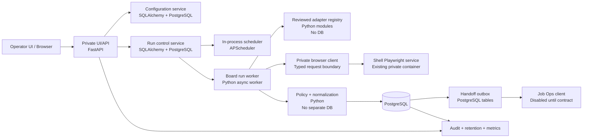
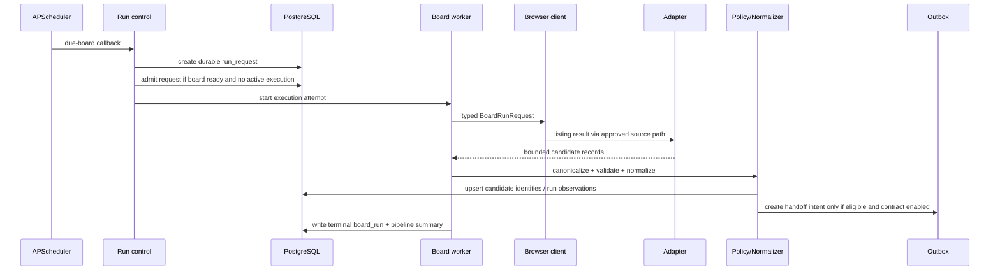
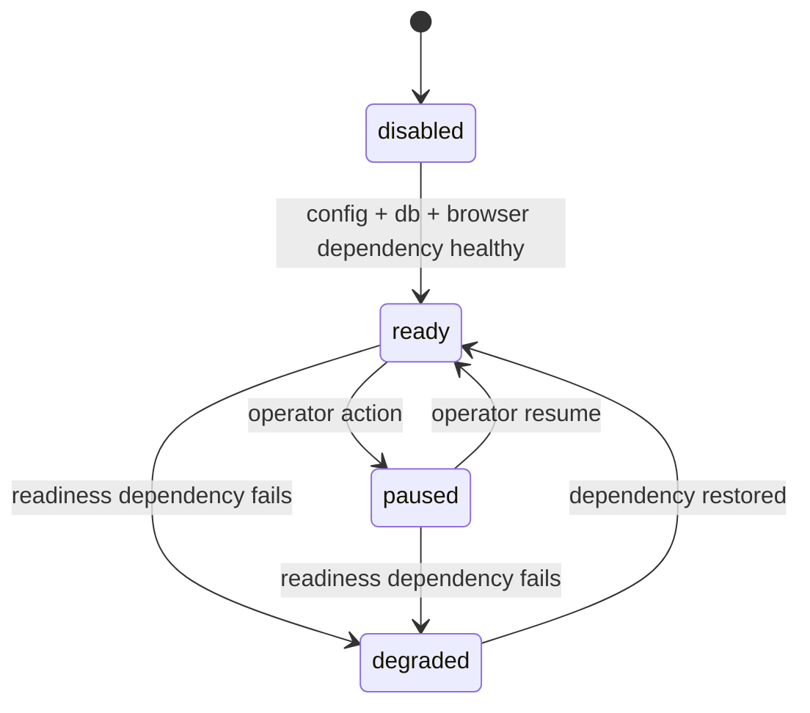
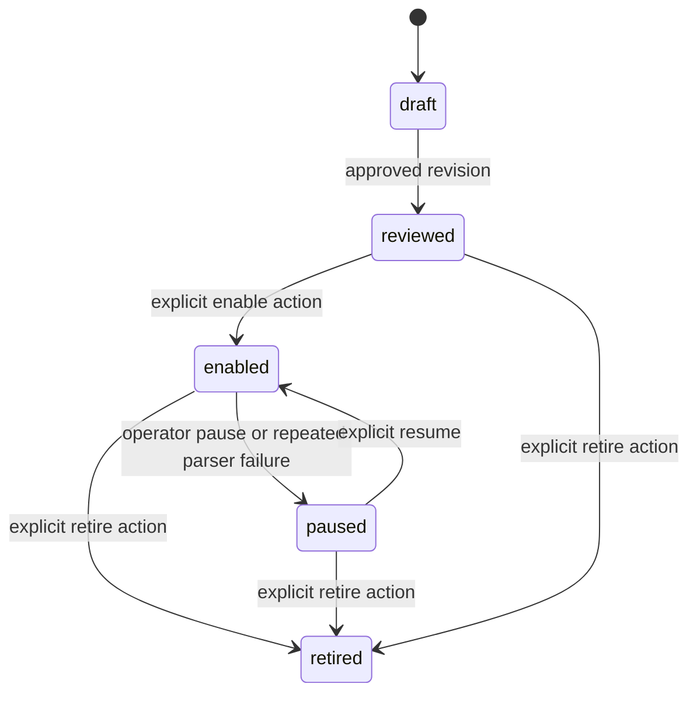
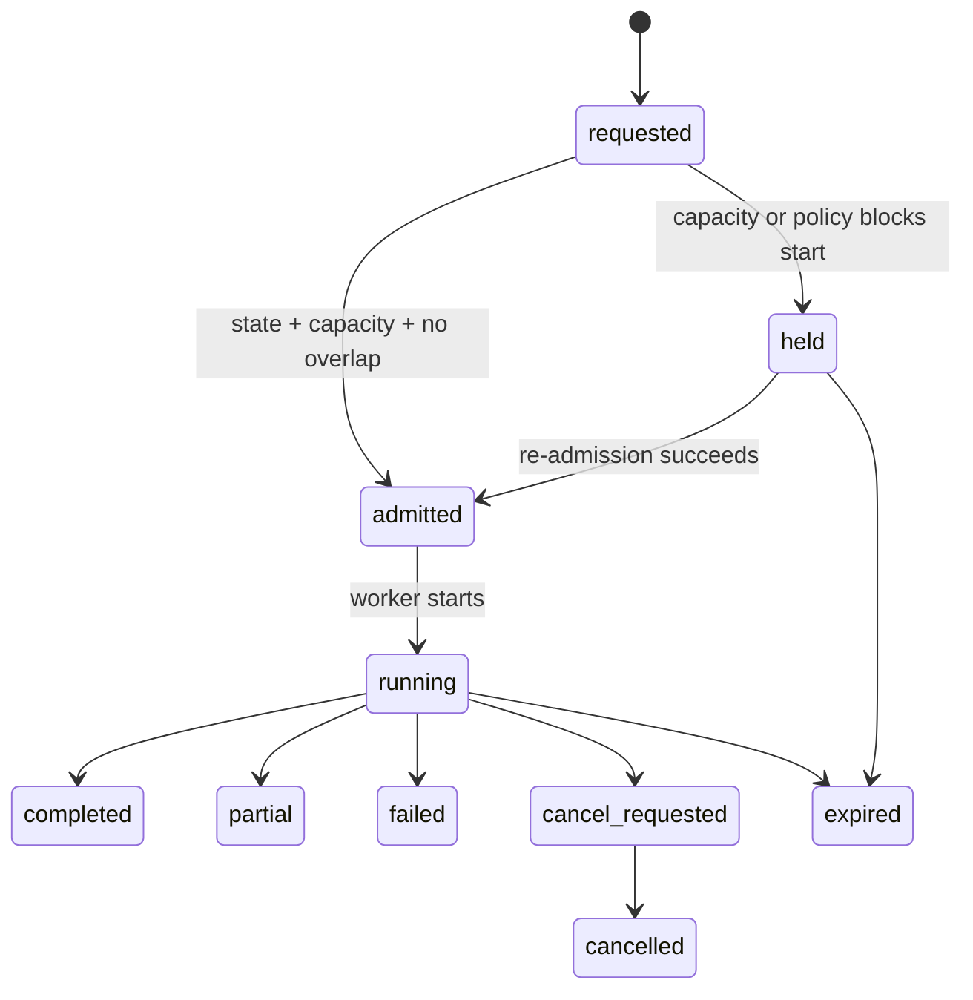
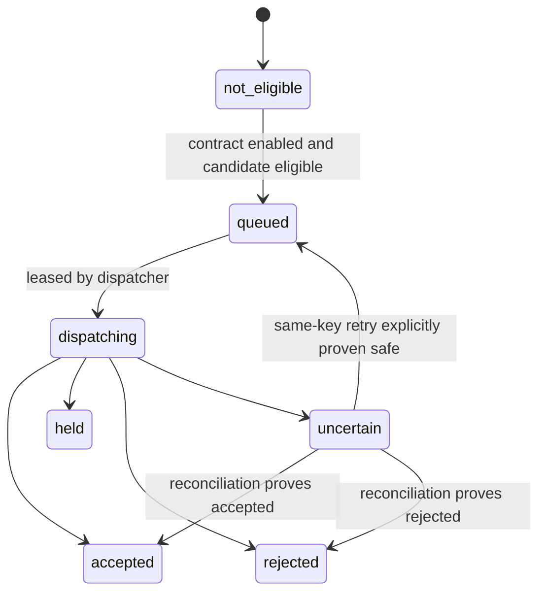

# Job Radar — System Design Summary and Open Decisions

> **Decision gate:** This document intentionally replaces the earlier deeper draft with a **review-summary pass** aligned to the new `system-design` skill. It is **not** the final implementation-ready design. It records confirmed decisions, recommended structure, and the material open decisions that must be resolved before the detailed design is finalized.

## 1. Executive summary and scope boundaries

Job Radar is a private, self-hosted service for monitoring individually approved public company-career listing URLs, discovering candidate jobs, normalizing approved public detail data, deduplicating repeat observations, and eventually handing eligible discoveries to Job Ops through a typed idempotent boundary.

This summary pass keeps the project within the approved sequence:

- research and design are authorized;
- implementation, production deployment, board enablement, scheduled collection, PostgreSQL rollout, and Job Ops handoff are **not** authorized by this note;
- the existing static operator UI and private Playwright browser service remain design inputs, not implementation commitments beyond their already approved existence.

### Scope boundaries

**In scope for this design pass**
- the service decomposition and deployment direction;
- confirmed runtime, database, scheduler, and operator-update direction;
- data/state boundaries for boards, runs, candidates, and handoff intents;
- open decisions that block a final implementation-ready design.

**Out of scope for this design pass**
- live board runs;
- Job Ops contract invention;
- credentials or secret values;
- UI implementation details beyond the operator-facing contract;
- changing the Shell Playwright container behavior;
- deployment execution.

## 2. Requirements, assumptions, confirmed decisions, and traceability

### Functional requirements

1. Maintain a reviewed inventory of approved boards and adapter families.
2. Run scheduled and manual acquisition without overlap.
3. Use official public ATS APIs where available, otherwise the private Playwright service.
4. Normalize approved public detail data and deduplicate repeated observations.
5. Present safe operator views for boards, configuration, runs, audit outcomes, and extracted jobs.
6. Submit only eligible, previously unseen jobs to Job Ops after a reviewed contract exists.

### Non-functional requirements

- Private deployment on The Shell.
- PostgreSQL as the authoritative transactional store.
- Privacy-safe observability: no raw upstream payloads, cookies, tokens, headers, or browser internals.
- Seven-day detailed run retention.
- Bounded browser/resource usage.
- Conservative failure handling with explicit `held`, `partial`, and `uncertain` states.

### Confirmed decisions from Priyesh

| Requirement area | Confirmed decision | Traceability |
|---|---|---|
| Database | **PostgreSQL** is the authoritative store. | Explicit user direction |
| Runtime | **Python + FastAPI + SQLAlchemy** | Explicit user direction |
| Scheduling architecture | **Async APScheduler in-process** with the service | Explicit user direction |
| Browser acquisition | Private self-hosted Playwright service on The Shell | Prior approved design direction |
| Operator update model | Push-style updates via **Server-Sent Events (SSE)** (`GET /api/v1/stream`) | Explicit user direction |
| Design artifact location | Obsidian is canonical; `system-design.html` is mirrored into the Gaming PC UI prototype | Explicit user direction |
| Operator Authentication | **Reverse-proxy auth headers (`X-Remote-User`, `X-Remote-Role`) + Bearer token fallback** | Explicit user direction |
| Role Model | **2 roles (`admin` for mutations/triggers, `viewer` for read-only monitoring)** | Explicit user direction |
| UI Stack & Delivery | **Vite + React SPA compiled to `dist/`, served via FastAPI static mount** | Explicit user direction |
| Job Ops Auth & Handoff | **Username/Password HTTP Basic Auth**; outbox disabled (`handoff_enabled: false`) until endpoint & creds configured | Explicit user direction |
| Secret Storage | **Environment variables via `.env` file** | Explicit user direction |
| Recovery Targets | **RPO = 24h, RTO = 1h**; daily automated `pg_dump` backups to host volume | Explicit user direction |
| Initial Enabled Board Set | **Staggered rollout starting with 5 low-risk boards** (Coupa/Lever, Amazon, Eightfold, Avature, HighRadius); Google/Meta manual-only | Explicit user direction |
| Auto-Pause Threshold | **Automatically pause board after 3 consecutive `parser_contract` failures** | Explicit user direction |

### Resolved Decisions Summary

All 9 material open decisions have been resolved and approved by Priyesh:
1. **Auth:** Caddy/Authelia reverse-proxy headers (`X-Remote-User`, `X-Remote-Role`) with API Bearer token fallback.
2. **Roles:** `admin` (full execution, config, manual triggers) and `viewer` (read-only monitoring).
3. **Live Updates:** Server-Sent Events (SSE) at `GET /api/v1/stream` for real-time run progress and logs.
4. **UI Delivery:** Vite + React SPA compiled down to static assets (`dist/`), served by FastAPI's static file mount.
5. **Job Ops:** Auth uses Username/Password (Basic Auth); outbox handoff disabled by default until endpoint and credentials are provided.
6. **Secrets:** Standard 12-factor `.env` file passed into container environment.
7. **Recovery:** RPO 24h / RTO 1h satisfied via daily automated `pg_dump` backups to local disk.
8. **Rollout:** Staggered production rollout beginning with 5 low-risk boards (Coupa/Lever, Amazon, Eightfold, Avature, HighRadius).
9. **Resilience:** Automatic board pausing after 3 consecutive `parser_contract` failures.

## 3. Architecture: diagram, components, responsibilities, interfaces, dependencies, tech stack, and storage

### Mermaid architecture diagram

### Component summary

| Component | Responsibility | Technology | Storage/database | Dependencies | Failure behavior |
|---|---|---|---|---|---|
| Operator UI/API | Serve private operator views and mutation endpoints | FastAPI | PostgreSQL read/write | Auth boundary, config service, run service | Read-only views degrade when DB unavailable; mutations rejected if service not ready |
| Configuration service | Board drafts, reviewed revisions, enable/pause/retire transitions | Python + SQLAlchemy | PostgreSQL | Validation rules, adapter schema definitions | Invalid configs stay draft/rejected; no silent live mutation |
| Run control service | Manual-run admission, run-request lifecycle, execution orchestration | Python + SQLAlchemy | PostgreSQL | Scheduler, worker, policy, outbox | New admissions held/blocked when capacity or readiness fails |
| In-process scheduler | Due-board selection and run-request creation | APScheduler | PostgreSQL state | Run control service | Misfires coalesce per approved policy; no overlapping active request |
| Board run worker | Execute one approved board run at a time initially | Python async worker | PostgreSQL stage + result records | Adapter registry, browser client, policy | Writes safe stage outcomes; can terminate as `partial`, `failed`, or `expired` |
| Adapter registry | Family-specific listing/detail extraction rules | Python modules | none | Reviewed board revision config | `parser_contract` or `not_observed`; never guessed endpoints |
| Private browser client | Typed communication to Shell Playwright service | Python client | none | Existing `job-radar-browser` | Fails safely with `timeout`, `challenge`, or `provider_failure` |
| Policy + normalization | Canonicalize URLs, validate detail routes, normalize required fields | Python | PostgreSQL candidate tables | Adapter output, reviewed route policy | Rejects invalid candidates as `policy_rejected`; no raw payload persistence |
| Handoff outbox + Job Ops client | Queue eligible jobs and later submit using one stable key | Python + SQLAlchemy | PostgreSQL outbox tables | Approved Job Ops contract | Remains `held`/`not_eligible` until contract exists; ambiguous dispatch becomes `uncertain` |
| Observability + retention | Safe metrics, audit history, seven-day run detail purge | Python tasks + SQL | PostgreSQL + logs | All service components | Never stores raw upstream payloads or secrets |

### Component notes

#### `component-ui-api`
The private UI/API is the only operator-facing surface. It exposes safe board, run, candidate, and audit information and the future live-update stream. It must not proxy arbitrary browser actions or reveal internal browser endpoints.

#### `component-config-service`
Board configuration is revisioned and review-gated. A new draft cannot silently replace the current reviewed revision.

#### `component-run-control`
Run control owns request creation, admission checks, cancellation, and lifecycle transitions. It is the boundary that keeps scheduler ticks, manual runs, and worker execution consistent.

#### `component-scheduler`
The scheduler runs inside the service process using APScheduler. It creates durable run requests rather than directly executing board logic from the scheduling callback.

#### `component-worker`
The worker performs staged acquisition and writes safe progress. Initial scaling model: one active board run at a time until capacity testing proves a higher limit.

#### `component-adapters`
Adapters remain application-owned implementations keyed by reviewed family names such as `oracle`, `workday`, `lever`, `eightfold`, or board-specific `custom` contracts.

#### `component-browser-client`
The browser client speaks only the typed internal request shape required for one board run. It is not an operator tunnel and not a generic browser API.

#### `component-policy-normalization`
Canonicalization, deduplication, and safe field extraction remain distinct from browser/runtime concerns.

#### `component-outbox`
The outbox is the durable boundary between candidate eligibility and eventual Job Ops dispatch.

#### `component-observability`
Observability is safe-by-default: bounded metadata, outcome codes, timestamps, counts, and audit reasons only.

## 4. Core flows: request/data/event sequence, consistency and idempotency boundaries

### Scheduled run sequence

### Consistency and idempotency boundaries

- `run_request` creation is durable before worker execution begins.
- One board cannot have overlapping active execution attempts.
- Candidate identity is stable across repeated observations.
- Handoff intent is keyed by stable candidate identity plus contract revision.
- No ambiguity at the handoff boundary is resolved by blind resend.

### Manual run summary

A manual run is an operator request recorded in the same durable admission pipeline as a scheduled run. It differs only in origin, audit metadata, and capacity prioritization.

## 5. API and event contracts: authentication, inputs, outputs, errors, versioning, and ownership

This pass records a **proposed** API surface, not a frozen contract.

### Proposed API summary

| Endpoint | Purpose | Ownership | Notes |
|---|---|---|---|
| `GET /health` | Process liveness | service | no board/network dependency |
| `GET /ready` | DB/config/browser dependency readiness | service | no live board or Job Ops call |
| `GET /api/v1/summary` | dashboard metrics | UI/API | safe aggregates only |
| `GET /api/v1/boards` | board inventory and status | UI/API | reviewed summary only |
| `GET /api/v1/boards/{id}` | board detail, revision summary, safe recent runs | UI/API | no secrets/raw payloads |
| `POST /api/v1/boards/{id}/revisions` | create draft revision | config service | review-gated mutation |
| `POST /api/v1/boards/{id}/revisions/{rev}/review` | approve/reject revision | config service | reviewer role required |
| `POST /api/v1/boards/{id}/state` | enable/pause/retire board | config service | explicit transition |
| `POST /api/v1/boards/{id}/test` | ephemeral safe board test | run control | no persistent handoff |
| `GET /api/v1/runs` | pipeline run list | UI/API | cursor-based |
| `GET /api/v1/runs/{id}` | run detail | UI/API | seven-day detail retention |
| `POST /api/v1/run-requests` | manual run request | run control | audit reason required |
| `GET /api/v1/jobs` | normalized extracted jobs | UI/API | searchable/filterable safe fields |
| `GET /api/v1/stream` | live update stream | UI/API | SSE recommended; token protected |

### Errors and versioning

- All operator endpoints remain under `/api/v1`.
- Mutation endpoints require explicit idempotency semantics before finalization.
- Errors should resolve to safe classes such as `validation_failed`, `not_authorized`, `state_conflict`, `capacity_held`, `not_ready`, and `not_found`.

## 6. Data model: schema/entity definitions, keys, constraints, indexes, ownership, retention, and migrations

### Proposed entities

| Entity | Purpose | Key fields | Retention / ownership |
|---|---|---|---|
| `boards` | stable board identity | `board_id`, display name, family, current reviewed revision | durable |
| `board_revisions` | immutable reviewed/draft config | revision id, board id, state, typed config, approval metadata | durable |
| `run_requests` | durable scheduled/manual intent | request id, origin, board scope, scheduled time, audit metadata | durable until audit policy decides otherwise |
| `execution_attempts` | concrete worker attempt | execution id, request id, lease token/fence, stage, terminal outcome | seven-day detail + required audit metadata |
| `pipeline_runs` | operator-visible run aggregate | pipeline id, trigger, status, counts, terminal time | seven-day detail |
| `board_runs` | one board’s contribution to a pipeline | board_run id, revision, stage, outcome, safe message | seven-day detail |
| `candidate_jobs` | canonical discovered identity | identity key, canonical URL hash, stable source id, normalized fields | durable identity ledger |
| `run_candidates` | observation edge for a run | run id, board id, candidate id, observation outcome | seven-day detail |
| `handoff_outbox` | durable handoff intent | candidate id, contract revision, idempotency key, state, next action | durable through reconciliation |
| `handoff_attempts` | dispatch history | outbox id, attempt seq, start/end, safe result class | audit-policy controlled |
| `audit_events` | append-only mutation/security audit | actor, role, action, entity, reason, correlation id | durable |

### Migration and ownership summary

- Migrations are forward-only and explicitly reviewed.
- SQLAlchemy models own schema shape; Alembic or an equivalent migration tool will own versioning in the later detailed pass.
- PostgreSQL remains the single source of truth for scheduler admission, run state, candidate identity, and outbox state.

## 7. Stateful behavior integrated with the relevant component/flow: lifecycle diagrams and transition tables

### Global service lifecycle

| Transition | Trigger | Guard | Side effect |
|---|---|---|---|
| `disabled → ready` | startup/readiness pass | DB/config/browser dependency healthy | scheduling may resume |
| `ready → paused` | operator/admin action | authorized actor | no new admissions |
| `ready → degraded` | readiness failure | none | new admissions blocked |
| `degraded → ready` | dependency restored | health checks pass | scheduling unblocked |

### Board lifecycle

| Transition | Trigger | Guard | Notes |
|---|---|---|---|
| `draft → reviewed` | reviewer approval | config valid | makes revision eligible for enablement |
| `reviewed → enabled` | explicit enable | global service ready, schedule present | board may be admitted |
| `enabled → paused` | operator pause or safety automation | authorized action or approved threshold | stops new admissions |
| `* → retired` | explicit retire | authorized action | permanent operational removal |

### Run request and execution lifecycle

| Transition | Trigger | Guard | Recovery / retry |
|---|---|---|---|
| `requested → admitted` | scheduler/manual admission | board enabled, service ready, capacity available | creates execution attempt |
| `requested → held` | admission blocked | capacity/policy/review gate | reevaluate later if applicable |
| `running → partial` | limit reached with bounded useful data | safe stage output exists | no success overstatement |
| `running → failed` | non-retryable fatal outcome | terminal failure classification | may create future request, not same active attempt |
| `running → cancel_requested → cancelled` | operator cancellation | authorized actor | no later stage starts |
| `* → expired` | lease or deadline failure | recovery timeout reached | requires reaper handling |

### Handoff lifecycle

State explicitly without separate lifecycle models:
- Adapter registry: no independent persisted lifecycle beyond application deployment.
- Browser client: no business lifecycle beyond request/response and service readiness.

## 8. Security, privacy, permissions, abuse controls, and auditability

- No raw HTML, raw JSON bodies, cookies, auth headers, tokens, screenshots, console output, selectors, or browser traces are stored in the operator surface or durable audit history.
- URL policy remains explicit: public DNS only, HTTPS only, exact reviewed host/path rules, no credential-bearing URLs, and redirect revalidation.
- Browser access remains application-owned and typed; there is no arbitrary Playwright execution path.
- Recommended role direction for the next pass: `viewer`, `operator`, `config_editor`, `reviewer`, `service_admin`.
- Every mutation should emit append-only audit metadata with actor, role, target entity, reason, and correlation id.
- Abuse controls needed in the final design: rate limits on mutations, quota on manual runs, bounded board-test capacity, and no-store responses for authenticated data.

## 9. Failure modes, retries, degradation, recovery, and operational runbooks

### Expected safe outcome taxonomy

- `success`
- `empty_verified`
- `partial_limit_reached`
- `challenge`
- `blocked_resource`
- `timeout`
- `parser_contract`
- `provider_failure`
- `policy_rejected`
- `capacity_held`
- `handoff_rejected`
- `handoff_uncertain`

### Retry and degradation summary

- Retry only explicitly transient acquisition failures.
- Do not retry `challenge`, `blocked_resource`, or `parser_contract` blindly.
- Handoff ambiguity becomes `uncertain`, not automatic resend.
- Service degradation blocks new admissions while preserving existing auditability.

### Recovery summary

- PostgreSQL backup/restore strategy, WAL/PITR need, and recovery objectives remain open decisions.
- Recovery must preserve candidate identity and outbox idempotency semantics.

## 10. Deployment, environments, scalability, observability, cost-sensitive choices, and SLOs

### Environments

- **Development:** Gaming PC worktree and static/UI experimentation.
- **Production target:** The Shell, behind a private boundary.
- **Private dependency:** existing `job-radar-browser` Playwright container on The Shell.

### Scalability direction

- Start with one active board run at a time.
- Use PostgreSQL to coordinate admission and persistent run state.
- Increase concurrency only after approved capacity testing.

### Observability direction

- Safe metrics: run counts, durations, held counts, candidate counts, outbox state counts, readiness state, retention deletion counts.
- Safe live updates: operator stream over token-protected SSE or WebSocket.

### Cost-sensitive choices

- In-process scheduler avoids an extra always-on control plane.
- PostgreSQL is the only authoritative database rather than mixing queue/state stores.
- Existing Playwright service is reused rather than embedding Chromium in the API process.

### Early SLO framing for later approval

These are placeholders, not approved targets:
- readiness should reflect database/config/browser dependency health accurately;
- the system should prefer conservative `held` or `partial` states over false success;
- no duplicate handoff intent should be created for the same candidate identity and contract revision.

## 11. Test plan, acceptance criteria, rollout/rollback, and implementation sequence

### Test plan summary for the later detailed pass

- schema and migration tests;
- board state and revision workflow tests;
- scheduler admission/non-overlap tests;
- adapter contract tests by family;
- browser-boundary safety tests;
- candidate identity and idempotency tests;
- handoff outbox reconciliation tests;
- retention and audit tests;
- operator API authorization and live-update tests.

### Acceptance criteria for this summary pass

- The architecture direction matches confirmed user choices.
- All unresolved material decisions are explicit rather than assumed.
- Markdown and HTML artifacts remain aligned.
- The canonical Obsidian copy and mirrored HTML copy stay synchronized.

### Rollout / rollback summary

- No rollout is authorized from this document.
- The next approved step after review is a **detailed implementation-ready design pass**, not coding.
- Rollback of this documentation change is simply document revision, not infrastructure rollback.

### Implementation sequence after review

1. Resolve the material open decisions in Section 2.
2. Expand this summary into the final decision-complete design with full contracts, lifecycle tables, and operational specifics.
3. Produce the approved implementation plan.
4. Implement in bounded phases.
5. Verify with automated and browser-facing tests before any production enablement.

## Explicit non-actions

This document does **not** implement code, create PostgreSQL, alter the Playwright container, enable any board, run the scheduler, connect the UI, define the Job Ops contract, dispatch a job, create a secret, or deploy a service.
